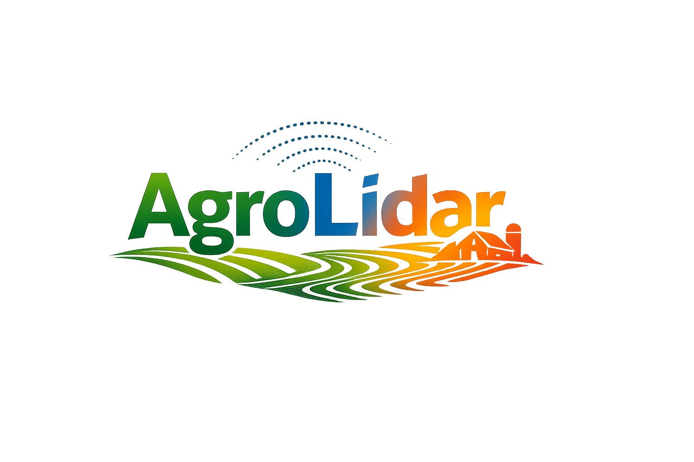

<h1 align="center">AgroLidar 🌾</h1>

  LiDAR perception system for agricultural machines

  🚜 Safer operations &nbsp;&nbsp;|&nbsp;&nbsp; 🌫️ Robust in harsh conditions &nbsp;&nbsp;|&nbsp;&nbsp; 🧠 AI-powered perception

---

## 🌍 Vision

We are building the perception layer for the next generation of agricultural machines.

Autonomous and assisted tractors require systems that truly understand the field — not the road.

AgroLidar is designed to operate where traditional autonomy struggles:
- Unstructured terrain  
- Dust, rain and low visibility  
- Dynamic agricultural environments  

---

## 🚀 What we do

AgroLidar transforms raw LiDAR data into actionable intelligence:

- Obstacle detection (humans, animals, vehicles, rocks, posts)
- Distance estimation and collision risk analysis  
- Terrain-aware perception  
- Hazard scoring for real-time decision making  
- Temporal tracking and motion understanding  

---

## ⚡ Why AgroLidar

Most autonomous systems are built for cities.

We are building for the field.

AgroLidar focuses on:
- Reliability over perfect conditions  
- Safety over aesthetics  
- Real-world performance over benchmarks  

---

## 🧠 Technology

- LiDAR-based perception  
- Bird’s Eye View deep learning models  
- Robust preprocessing for noisy environments  
- Temporal fusion and tracking  
- Edge-ready inference  

---

## 🌱 Use Cases

- Autonomous tractors  
- Driver-assist safety systems  
- Smart agricultural machinery  
- Field monitoring and obstacle awareness  

---

## 🛠️ Projects

- 🔹 **AgroLidar Core**  
  Production-oriented LiDAR perception system for agriculture  

---

## 📈 Roadmap

- Multi-sensor fusion (LiDAR + camera)  
- Edge deployment optimization (Jetson / Orin)  
- Real-world agricultural dataset integration  
- Advanced hazard prediction models  

---

## 🤝 Join the vision

We believe agriculture deserves the same level of innovation as autonomous driving.

If you're interested in building the future of agri-tech, let's connect.

---

  🌾 AgroLidar — Perception for the field

